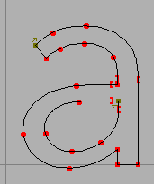
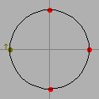
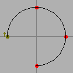

# Spiro  [](https://scan.coverity.com/projects/794)

## Introduction



Spiro is the creation of [Raph Levien](http://www.levien.com/). It simplifies the drawing of beautiful curves.

Using bézier splines an artist can easily draw curves with the same slope on either side of an on-curve point. Spiros, on the other hand, are based on clothoid splines which make it easy to maintain constant curvature as well as constant slope. Such curves will simply look nicer.

Raph Levien's spiro splines only use on-curve points and so are easier to use and more intuitive to the artist.

This library will take an array of spiro control points and convert them into a series of bézier splines which can then be used in the myriad of ways the world has come to use béziers.

## Installation

Installing from Git master requires 2 preparatory steps:

First, you need to create the ./configure script if you do not have it yet
```sh
autoreconf -i
automake --foreign -Wall
```

Second, you then use the usual steps to compile the library.
Various operating systems and setups will need ./configure options set.
The INSTALLATION file has detailed info for `configure' options.
Example install steps for Linux, FreeBSD, Win32/64 are shown below:

Installing on Linux
```sh
./configure
make
make check
sudo make install
```

Installing on FreeBSD
```sh
./configure --prefix=$(pwd)/BUILD
make clean
make
make install
```

Installing on Windows 32-bit
```sh
./configure --host=i686-w64-mingw32 --prefix=$(pwd)/build-w32
make clean
make
make install
```

Installing on Windows 64-bit
```sh
./configure --host=x86_64-w64-mingw32 --prefix=$(pwd)/build-w64
make clean
make
make install
```

## Usage

### In FontForge

FontForge will autodetect libspiro when it is installed in the usual way.

An exception to this is with the Mac bundled version (where `FontForge.app` is copied to `/Applications`.) To install your compiled version into the bundle, run ```sh ./configure --prefix=/Applications/FontForge.app/Contents/Resources/opt/local/ ```

#### Crash Reporting

Mac OS X: A helping script, `./fontforge.sh` is provided to run FontForge inside a debugger to get useful information on solving crashes. An example issue is at https://github.com/fontforge/libspiro/issues/4

# Developing

### Two methods of using libspiro in your programs

- [C](#programming-with-libspiro-in-c)
- [Java](#programming-with-libspiro-in-java)

### Programming with libspiro in C

- Basic Type
  - [spiro control point](#the-spiro-control-point)
  - [bézier context](#the-bezier-context)
- [Header file](#calling-into-libspiro)
- Entry points
  - int [SpiroCPsToBezier0](#spirocpstobezier)(spiro_cp *,int n,int is_closed,bezctx *)
  - int [TaggedSpiroCPsToBezier0](#taggedspirocpstobezier)(spiro_cp *,bezctx *)

#### Basic Types

#### The spiro control point

```c
typedef struct {
    double x;
    double y;
    char ty;
} spiro_cp;

    /* Possible values of the "ty" field. */
#define SPIRO_CORNER		'v'
#define SPIRO_G4		'o'
#define SPIRO_G2		'c'
#define SPIRO_LEFT		'['
#define SPIRO_RIGHT		']'

    /* For a closed contour add an extra cp with a ty set to */
#define SPIRO_END		'z'
    /* For an open contour the first cp must have a ty set to*/
#define SPIRO_OPEN_CONTOUR	'{'
    /* For an open contour the last cp must have a ty set to */
#define SPIRO_END_OPEN_CONTOUR	'}'
```

A spiro control point contains a location and a point type. There are five basic types of spiro control points:

- A corner point – where the slopes and curvatures of the incoming and outgoing splines are unconstrained
- A G4 curve point – Continuous up to the fourth derivative
- A G2 curve point – Continuous up to the second derivative.
- A left constraint point – Used to connect a curved line to a straight one
- A right constraint point – Used to connect a straight line to a curved one.
  If you have a contour which is drawn clockwise, and you have a straight segment at the top, then the left point of that straight segment should be a left constraint, and the right point should be a right constraint.

#### The bezier context

```c
struct _bezctx {
    /* Called by spiro to start a contour */
    void (*moveto)(bezctx *bc, double x, double y, int is_open);

    /* Called by spiro to move from the last point to the next one on a straight line */
    void (*lineto)(bezctx *bc, double x, double y);

    /* Called by spiro to move from the last point to the next along a quadratic bézier spline */
    /* (x1,y1) is the quadratic bézier control point and (x2,y2) will be the new end point */
    void (*quadto)(bezctx *bc, double x1, double y1, double x2, double y2);

    /* Called by spiro to move from the last point to the next along a cubic bézier spline */
    /* (x1,y1) and (x2,y2) are the two off-curve control point and (x3,y3) will be the new end point */
    void (*curveto)(bezctx *bc, double x1, double y1, double x2, double y2,
            double x3, double y3);

    /* I'm not entirely sure what this does -- I just leave it blank */
    void (*mark_knot)(bezctx *bc, int knot_idx);
};
```

You must create a super-class of this abstract type that handles the creation of your particular representation of bézier splines. As an [example I provide the one used by Raph to generate PostScript output](bezctx.md) (cubic béziers). Spiro will convert a set of spiro_cps into a set of bézier curves. As it does so it will call the appropriate routine in your bézier context with this information – this should allow you to create your own internal representation of those curves.

#### Calling into libspiro

Your program needs this Libspiro header file:

```c
#include <spiroentrypoints.h>
```

You must define a bézier context that is appropriate for your internal splines (See [Raph's PostScript example](bezctx.md)).

#### SpiroCPsToBezier0

You must create an array of spiro control points:

```c
   spiro_cp points[4];

     /* This defines something very like a circle, centered at the origin with radius 100 */

   points[0].x = -100; points[0].y =    0; points[0].ty = SPIRO_G4;
   points[1].x =    0; points[1].y =  100; points[1].ty = SPIRO_G4;
   points[2].x =  100; points[2].y =    0; points[2].ty = SPIRO_G4;
   points[3].x =    0; points[3].y = -100; points[3].ty = SPIRO_G4;
```



Then call `SpiroCPsToBezier0`, a routine which takes 4 arguments and returns bc and an integer pass/fail flag.

1. An array of input spiros
2. The number of elements in the spiros array
3. Whether this describes a closed (True) or open (False) contour
4. A bézier results output context
5. An integer success flag. 1 = completed task and have valid bézier results, or  0 = unable to complete task, bézier results are invalid.
   ```c
    bc = new_bezctx_ps();
    success = SpiroCPsToBezier0(points,4,True,bc)
    bezctx_ps_close(bc);

#### TaggedSpiroCPsToBezier0

Or call `TaggedSpiroCPsToBezier0`. This routine requires that the array of spiro control points be tagged according to Raph's internal conventions. A closed curve will have an extra control point attached to the end of it with a type of `SPIRO_END`;

```c
   spiro_cp points[5];

   points[0].x = -100; points[0].y =    0; points[0].ty = SPIRO_G4;
   points[1].x =    0; points[1].y =  100; points[1].ty = SPIRO_G4;
   points[2].x =  100; points[2].y =    0; points[2].ty = SPIRO_G4;
   points[3].x =    0; points[3].y = -100; points[3].ty = SPIRO_G4;
   points[4].x =    0; points[4].y =    0; points[4].ty = SPIRO_END;
```

(The location of this last point is irrelevant).

An open curve will have the type of the first control point set to `SPIRO_OPEN_CONTOUR` and the last to `SPIRO_END_OPEN_CONTOUR`.

```c
   spiro_cp points[4];

   points[0].x = -100; points[0].y =    0; points[0].ty = SPIRO_OPEN_CONTOUR;
   points[1].x =    0; points[1].y =  100; points[1].ty = SPIRO_G4;
   points[2].x =  100; points[2].y =    0; points[2].ty = SPIRO_G4;
   points[3].x =    0; points[3].y = -100; points[3].ty = SPIRO_END_OPEN_CONTOUR;
```



(In an open contour the point types of the first and last control points are going to be ignored).

In this case there is no need to provide a point count nor an open/closed contour flag. That information can be obtained from the control points themselves. So `TaggedSpiroCPsToBezier0` only takes 2 arguments and returns bc and an integer pass/fail flag.

1. An array of input spiros
2. A bézier results output context
3. An integer success flag. 1 = completed task and have valid bézier results, or  0 = unable to complete task, bézier results are invalid.
   ```c
    bc = new_bezctx_ps();
    success = TaggedSpiroCPsToBezier0(points,bc)
    bezctx_ps_close(bc);
   ```

### Programming with libspiro in Java

**CAVEAT:** I'm not proficient in Java.

### Classes

- `SpiroPointType` – this is an enumerated type which defines the same pointtypes used by the C interface: `CORNER`, `G4`, `G2`, `LEFT`, `RIGHT`, `END`, `OPEN`, `OPEN_END`

- `SpiroCP`
  ```java
    public class SpiroCP {
    public double x,y;
    SpiroPointType type;
    public SpiroCP(double xx, double yy, SpiroPointType ty);
    public String toString();
}
  ```

- `SpiroBezierContext` – a Java interface used in conversion of an array of SpiroCPs to a Bézier contour.

  ```java
    public interface SpiroBezierContext {
    void MoveTo(double x, double y, boolean isOpen);
    void LineTo(double x, double y);
    void QuadTo(double x1, double y1, double x2, double y2);
    void CubicTo(double x1, double y1, double x2, double y2, double x3, double y3);
    void MarkKnot(int knotIdx);
    }
  ```

- `Spiro` – a class with only static members:

  ```java
    public class Spiro {
    // takes an array of SpiroCPs and converts to a Bézier
    static public void
      SpiroCPsToBezier(SpiroCP [] spiros,int n,boolean isclosed,
          SpiroBezierContext bc);
    // takes an array of SpiroCPs (the array contains its own terminator and indication of whether the contour is open or closed)
    static public void
      TaggedSpiroCPsToBezier(SpiroCP [] spiros,SpiroBezierContext bc);

    // Two routines for reading and writing one of Raph's plate files
    static public void
      SavePlateFile(Writer output,SpiroCP [][] spirocontours)
      throws IOException;
    static public SpiroCP [][]
      ReadPlateFile(BufferedReader input) throws IOException;
    }
  ```
